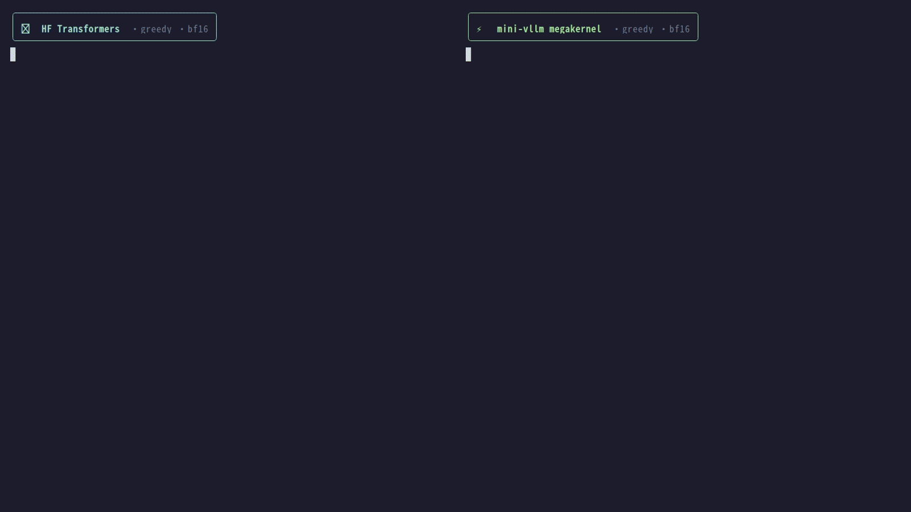

<div align="center">

# Mini-vLLM
A lightweight inference and quantization engine for studying LLMs.

[](https://www.python.org/downloads/)
[](https://pytorch.org/)
[](#)
</div>

## Streaming Inference & Megakernel 

<div align="center">


<sub>Qwen3-0.6B · bf16 · greedy · same prompt · 6 GB RTX 4050<br/>Left: HF Transformers · Right: mini-vllm megakernel</sub>

</div>

## Features

- **Fused CUDA Megakernel** -- single-kernel decode pipeline fusing embedding, all transformer layers, norm and LM head
- **CUDA Graph Decode** -- configurable bucketed CUDA Graphs to eliminate CPU launch overhead
- **AWQ 4-bit Quantization** -- built-in calibration and inference with Triton/CUDA kernels
- **SwanLab Monitoring** -- real-time throughput and memory tracking ([docs](docs/profiling.md))
- **lm-eval Benchmark** -- built-in evaluation harness adapter ([docs](docs/benchmark.md))

## Supported Models

| Model | Model Backend | Attention Backend |
|-------|--------------|-------------------|
| Qwen3 | `default`, `megakernel_cuda` | `sdpa`, `flash_attn`, `naive` |
| Qwen3.5 | `default` | `sdpa`, `flash_attn`, `naive`, `fla` |

## Quick Start

### 1. Install

```bash
git clone https://github.com/BoundlessWindMoon/minivllm.git
cd mini-vllm

uv venv .venv --python 3.12
source .venv/bin/activate

# PyTorch (match your CUDA version)
uv pip install torch==2.9.0 --index-url https://download.pytorch.org/whl/cu128

# Core
uv pip install -e .

# Optional: flash-attn, lm-eval, swanlab, etc.
uv pip install -e ".[all]"

# flash-linear-attention (required for Qwen3.5 linear attention)
pip install flash-linear-attention --no-build-isolation
```

### 2. Download Model

```bash
HF_ENDPOINT=https://hf-mirror.com huggingface-cli download Qwen/Qwen3-0.6B --local-dir ~/huggingface/Qwen3-0.6B/

# Optional: Qwen3.5 (multimodal, requires flash-linear-attention)
HF_ENDPOINT=https://hf-mirror.com huggingface-cli download Qwen/Qwen3.5-0.8B --local-dir ~/huggingface/Qwen3.5-0.8B/
```

### 3. Run

```bash
# Qwen3 with megakernel backend
python main.py

# Qwen3.5 with cuda graph
python main.py --config configs/qwen3_5.yaml
```

### 4. Benchmark

```bash
python -m eval.run --config configs/qwen3_5.yaml --tasks arc_easy --limit 50
```

See [docs/benchmark.md](docs/benchmark.md) for task customization and log output.

## Documentation

- [Configuration Reference](docs/config.md) -- all YAML parameters
- [Benchmark Evaluation](docs/benchmark.md) -- lm-eval integration
- [Profiling & Monitoring](docs/profiling.md) -- PyTorch profiler, Perfetto, SwanLab
- [AWQ Quantization](docs/quantization.md) -- calibration and quantized inference

## Project Structure

```text
mini-vllm/
├── configs/            # YAML configs
├── engine/             # Inference loop, model runner, sampler
├── kernels/            # Triton & CUDA kernels
├── layers/             # Attention, MLP, RMSNorm, Rotary
├── model/              # Qwen3 / Qwen3.5 architectures
├── quantization/       # AWQ calibration and quantized layers
├── eval/               # lm-eval adapter
├── scripts/            # Benchmark, verify, profile tools
├── main.py             # Entry point: inference
└── quant.py            # Entry point: AWQ calibration
```

## Acknowledgements

- [nano-vllm](https://github.com/GeeeekExplorer/nano-vllm) -- minimalist inference architecture
- [AutoAWQ](https://github.com/casper-hansen/AutoAWQ) -- AWQ quantization
- [mega-qwen](https://github.com/coffee0224/mega-qwen) -- fused megakernel design

## License

MIT
